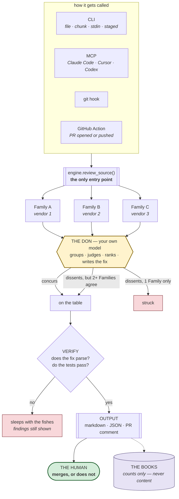

# GrumpySenior.dev — System Architecture

## The sit-down

**The one asymmetry that matters** is the middle of that diagram: the Don can promote a
finding but cannot silently kill a corroborated one. Everything else is plumbing.

## Step by step

| # | Stage | What happens | What can go wrong |
|---|---|---|---|
| 1 | **Trigger** | A CLI call, an MCP tool call from an agent, a pre-commit hook, or a PR webhook. Each is a thin adapter; none contains review logic. | — |
| 2 | **Assembly** | Whole file, an explicit line range, a pasted snippet, or your working tree. Excerpts are labelled, so Families don't report "missing imports" that live off-screen. | Large PRs. Reviews whole files with a per-PR cap, and **names the files it skipped** rather than implying full coverage. |
| 3 | **The Commission** | The same code goes to N Families — models from *different vendors* — in parallel, with no contact between them. Each returns findings plus its own corrected file. | A Family fails or returns unparseable output → dropped; the sit-down continues with fewer seats and **reports the reduced count**. Never a silent partial review. |
| 4 | **The Don** | Your own model groups findings that describe one defect, judges each against the code, ranks them, and writes the final fix. | **The core risk:** the Don is the model whose blind spots the Commission covers. Mitigated by the no-veto rule, not by trust. If he never shows, findings are clustered by a text heuristic and the output says so. |
| 5 | **Verify** | The fix must parse; optionally a configured command (tests, linter) runs against it. | A confidently-wrong "optimization". A fix that does not parse is never offered — its findings still are. |
| 6 | **Output** | Markdown for humans, JSON for agents, one PR comment edited in place. | — |
| 7 | **The human** | Reads, accepts, or ignores. Merging stays human by default; CI can fail a build but ships comment-only. | Rubber-stamping. Countered by surfacing few, high-confidence findings — and by printing disagreement instead of a smooth consensus. |
| 8 | **The Books** | One record per sit-down: which Families sat, what they corroborated, whether the fix verified, what it cost. Renders to a static page. | **Telemetry in a tool that reads source code.** Mitigated by schema, not policy: no code, no paths, no repo names, no finding text ever enters a record. Off entirely with one environment variable. |

## When the caller is itself a model — it becomes the Don

An agent calling this over MCP *is* the Don: it wrote the code and it holds the
conversation. That path skips stage 4 entirely — the agent receives the raw Commission
findings plus the no-veto rule as an explicit instruction, and presides itself.

This removes a model, a bill, and a second voice arguing with the first. It is also the
honest version of the design: the Don's chair was never about which model is smartest,
it was about who is talking to the developer.

## Failure modes, ranked by how likely they are to kill it

| Risk | Why it's dangerous | Mitigation |
|---|---|---|
| **Findings don't cluster** | Three Families describe one bug three ways and nothing matches. Agreement becomes fiction and the wedge evaporates. | Semantic grouping by the Don, not string matching. **This is the assumption to test first** — before the rest is worth building. |
| **The Don buries what he can't see** | The system quietly reverts to single-model review while looking more polished. | Consensus floor, enforced in code. He may object in public; he may never delete. |
| **Confidently-wrong fix** | One merged bad fix costs more trust than ten good catches earn. | Cross-vendor agreement as a filter, plus mechanical verification. Broken fixes are withheld; their findings survive. |
| **The weakest Family breaks the protocol** | A vendor that can't produce the required output shape silently shrinks the Commission — and the confidence numbers with it. | Code never travels inside JSON (see below). Failures are reported, never absorbed. |
| **Alert fatigue** | Ten low-severity notes and the bot is muted in a week. | Severity floor, consensus floor, tunable tone. Silence is a valid output and says so. |
| **Context limits** | A large PR doesn't fit, and a truncated review looks complete. | Per-file review, explicit chunk support, a cap that **names what it skipped**. |
| **Cost and latency** | N models per file is N times the bill. | Full Commission only on meaningful units, not on save. Agent mode drops the Don's call. Commission size is config. |
| **Code privacy** | Proprietary source to third-party APIs is a non-starter for some buyers. | One provider layer over Bedrock: the code stays inside the buyer's own AWS account, and local models are the same interface. |

## The failure that actually happened

The first live run lost a Family: Llama returned malformed JSON. Every model had been
asked to embed a whole source file inside a JSON string — to escape every newline and
quote in that file. Strong models manage it; weaker ones don't.

The first fix was a tolerant parser, and it made things worse: two Families failed on the
next run. The real fix was structural — **code never enters JSON at all.** Findings come
back as small JSON values; the corrected file follows a delimiter as plain text, with
nothing to escape. Consensus went 2/3 → 3/3 and the run got twice as fast.

A cross-vendor product lives or dies on its weakest member. "Make the strong model work"
and "make every vendor work" are different problems, and the second one is the product.

## Prototype vs product

**Built and working, verified against live models:** stages 1–6, all four triggers, the
no-veto rule, verification, the MCP server, the PR bot.

**Deliberately not built:** diff-awareness (reviews files, not hunks), inline
suggested-change anchoring, cost routing, persistence, non-Python verification, and any
record of which fixes were actually merged — which is both the north-star metric and the
tuning loop, and the first thing I would build next.
